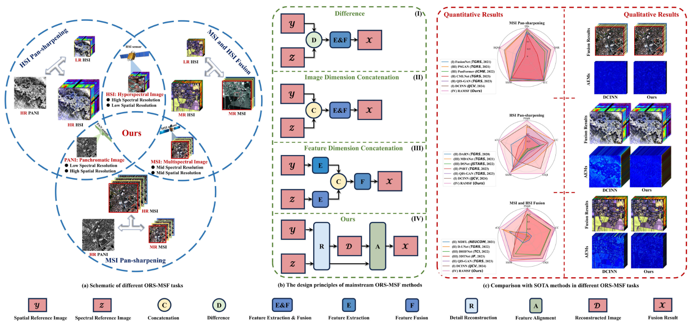
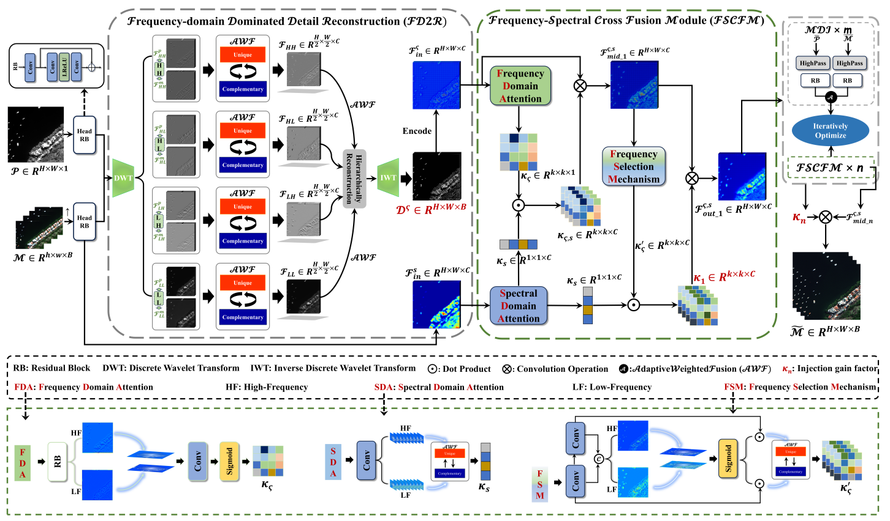
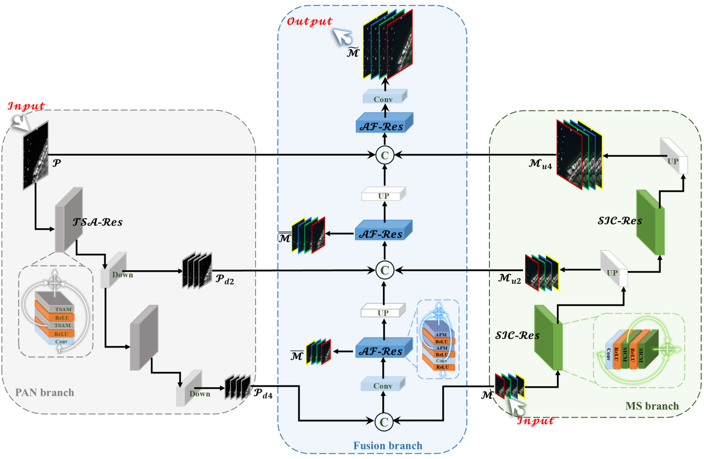
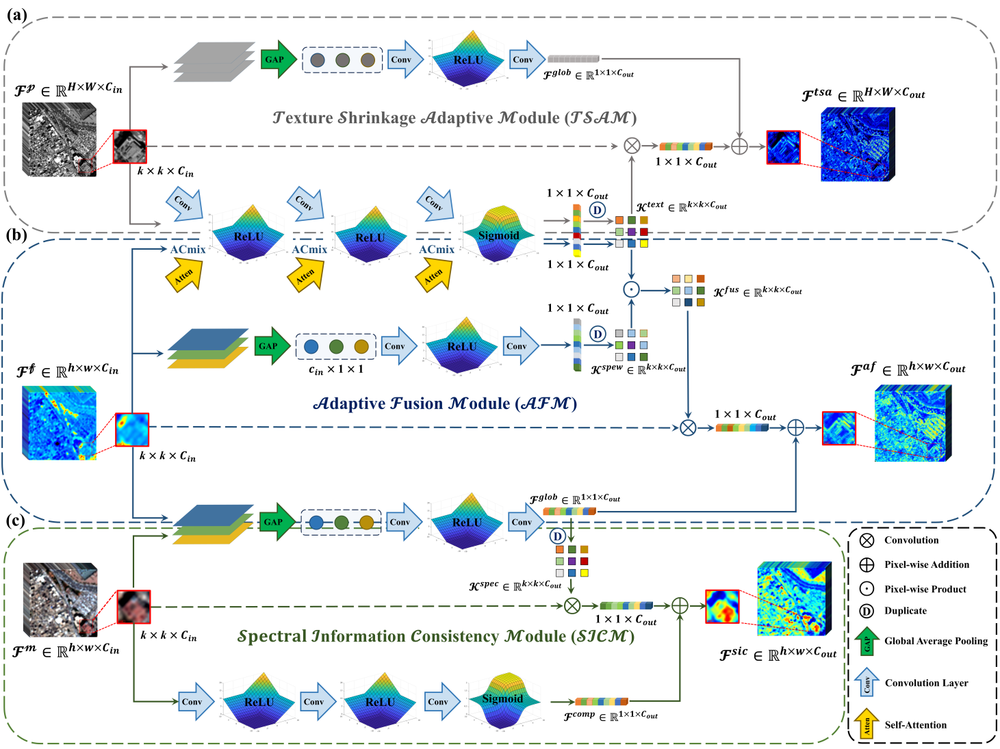

# RSMIF Project - Remote Sensing Multimodal Image Fusion Research Collection

## 📋 A Flexible and Extensible Project for Remote Sensing Multimodal Image Fusion

### 🆕 RAMSF (TGRS 2025)
**A Novel Generic Framework for Optical Remote Sensing Multimodal Spatial¨CSpectral Fusion**
<br>


**Highlights:**
- Generic framework for multiple fusion tasks with robust generalization
- Supports multispectral, hyperspectral, and SAR-optical fusion
- Advanced detail reconstruction and feature alignment

**Model Location:** `models/`

### 🌟 CF2N (GSIS 2024)
**A Novel Cross Fusion Model with Fine-grained Detail Reconstruction**
<br>


**Highlights:**
- Frequency-spectral dual domain cross fusion network
- Fine-grained detail reconstruction for pan-sharpening
- High frequency-spectral fidelity results

**Code Location:** `models/`

### 🏭 MMAPP (JSTARS 2024)
**Multi-branch and Multi-scale Adaptive Progressive Pyramid Network**
<br>

#### The AEIM in each branch:
<br>


**Highlights:**
- Multi-branch pyramid structure with adaptive modules
- Specialized AEIMs for different branches
- Excellent efficiency-performance balance

**Code Location:** `models/`

### ⚡ RSANet (JSTARS 2023)
**Recursive Self-Attention Modules-Based Network**

**Highlights:**
- Efficient recursive self-attention with minimal parameters
- Global-to-local strategy for spatial-spectral similarity extraction
- State-of-the-art performance in remote sensing image fusion

**Code Location:** `models/`

## 🎯 Abstract

This collection presents advanced methods for remote sensing image fusion, addressing the critical challenge of integrating heterogeneous remote sensing data to obtain high-resolution multispectral images while preserving both spatial details and spectral fidelity.

**Key Innovations:**
- Advanced handling of heterogeneity between source images
- Sophisticated detail reconstruction in frequency and spatial domains
- Multi-scale feature integration with adaptive mechanisms
- Improved spatial-spectral alignment for reduced distortion
- Enhanced generalization across different fusion tasks

## 🏗️ Method Overview

### RAMSF Framework Architecture

**Components:**
- **LHSDR**: Estimates joint spatial degradation and derives salient details
- **CSFPA**: Establishes coordinate-mode relations for accurate feature alignment

### CF2N Architecture

**Components:**
- **FD2R**: Adaptive weighted fusion of frequency details
- **FSCF**: Interactive cross fusion between frequency and spectral domains

### MMAPP Structure

**Adaptive Extraction and Integration Modules (AEIMs):**
- Texture shrinkage adaptive module for PAN branch
- Spectral information consistency module for MS branch
- Adaptive fusion module for Fusion branch

### RSANet Core Module

**Features:**
- Global-to-local strategy for capturing interdependencies
- Simultaneous consideration of spatial and spectral information
- Focus on mutual information between spectral and spatial dimensions

## 🚀 Quick Start

### Environment Setup

```bash
# For project
cd RSMIF

# Install dependencies using pip
pip install -r requirements.yaml

# Or using conda (for RSMIF)
conda env create -f requirements.yaml
```

### Training

You can easily integrate your methodology into our framework.
```bash
$ cd RSMIF
# An example command for training
$ python train.py --option_path option.yml
```

During the training, tensorboard logs are saved under the experiments directory. To run the tensorboard:

```bash
$ cd ./logs
$ tensorboard --logdir=. --bind_all
```
The TensorBoard visualization includes:
- Metric curves for performance monitoring
- Feature map visualization
- Loss progression tracking


### Testing
**Note:** With only batch size 1 is recomended. 
```bash
$ cd ./

# An example command for testing
$ python test.py --option_path option.yml
```

# 📡 Datasets

## Primary Data Sources

| Data Type | Data Source | Link |
|-----------|-------------|------|
| Multispectral Data | PanCollection | [Link](https://github.com/liangjiandeng/PanCollection) |
| Hyperspectral Data | HyperPanCollection | [Link](https://github.com/liangjiandeng/HyperPanCollection) |
| SAR-Optical Data | SEN2MS-CR | [Link](https://patricktum.github.io/cloud_removal/sen12mscr/) |

## Method Compatibility Matrix

| Method | Multispectral | Hyperspectral | SAR-Optical |
|--------|---------------|---------------|-------------|
| RAMSF | ? | ? | ? |
| CF2N | ? | ? | ? |
| MMAPP | ? | ? | ? |
| RSANet | ? | ? | ? |

## Dataset Preparation

### Steps
1. Download the corresponding datasets from the provided links
2. Follow the specific dataset preparation instructions in each project's documentation
3. Ensure proper file structure and data formatting as required by each method

# 🔥 Results and Performance

## Performance Highlights

| Method | Performance Highlights |
|--------|------------------------|
| RAMSF | Superior generalization across 10 datasets from 3 different fusion tasks |
| CF2N | State-of-the-art results in hyperspectral and SAR-optical fusion |
| MMAPP | Excellent balance between efficiency and performance in multispectral fusion |
| RSANet | Minimal parameters with competitive performance for constrained application scenarios |

## Efficiency Comparison

| Method | Parameters | Inference Speed | Performance | Best Use Case |
|--------|------------|-----------------|-------------|---------------|
| RSANet | Lowest | Fast | High | Constrained environments |
| MMAPP | Moderate | Balanced | Very High | General pan-sharpening |
| CF2N | Higher | Good | State-of-the-art | Complex fusion tasks |
| RAMSF | Highest | Good | State-of-the-art | Multi-task generalization |

## Key Findings

| Finding | Description |
|---------|-------------|
| Performance Superiority | All methods demonstrate superior performance over traditional approaches |
| Scenario Adaptability | Each method offers unique advantages for specific application scenarios |
| Task Coverage | The collection provides comprehensive coverage of remote sensing fusion tasks |
| Efficiency Maintenance | Methods maintain high efficiency while achieving state-of-the-art results |

# 📋 Citation

Please cite the respective papers when using each method:

**RAMSF (IEEE TGRS 2025)**

```bibtex
@ARTICLE{10934049,
  author={Liu, Chuang and Zhang, Zhiqi and Wang, Mi},
  journal={IEEE Transactions on Geoscience and Remote Sensing}, 
  title={RAMSF: A Novel Generic Framework for Optical Remote Sensing Multimodal Spatial-Spectral Fusion}, 
  year={2025},
  volume={63},
  number={},
  pages={1-22},
  doi={10.1109/TGRS.2025.3552937}}
```
**CF2N (Geo-spatial Information Science 2024)**

```bibtex
@article{doi:10.1080/10095020.2024.2416899,
author = {Chuang Liu and Zhiqi Zhang and Mi Wang and Shao Xiang and Guangqi Xie},
title = {A novel cross fusion model with fine-grained detail reconstruction for remote sensing image pan-sharpening},
journal = {Geo-spatial Information Science},
year = {2024},
doi = {10.1080/10095020.2024.2416899}}
```

**MMAPP (IEEE JSTARS 2024)**

```bibtex
@ARTICLE{10741347,
  author={Zhang, Zhiqi and Liu, Chuang and Wei, Lu and Xiang, Shao},
  journal={IEEE Journal of Selected Topics in Applied Earth Observations and Remote Sensing}, 
  title={MMAPP: Multi-branch and Multi-scale Adaptive Progressive Pyramid Network for Multispectral Image Pansharpening}, 
  year={2024},
  doi={10.1109/JSTARS.2024.3490755}}
```
**RSANet (IEEE JSTARS 2023)**
```bibtex
@ARTICLE{10294268,
  author={Liu, Chuang and Wei, Lu and Zhang, Zhiqi and Feng, Xiaoxiao and Xiang, Shao},
  journal={IEEE Journal of Selected Topics in Applied Earth Observations and Remote Sensing}, 
  title={Recursive Self-Attention Modules-Based Network for Panchromatic and Multispectral Image Fusion}, 
  year={2023},
  volume={16},
  pages={10067-10083},
  doi={10.1109/JSTARS.2023.3327167}}
```
  # 📬 Concat
  **We welcome feedback and questions about these methods. For technical support, implementation issues, or research collaborations, please feel free to contact me (email: chuang.liu@whu.edu.cn) .**
